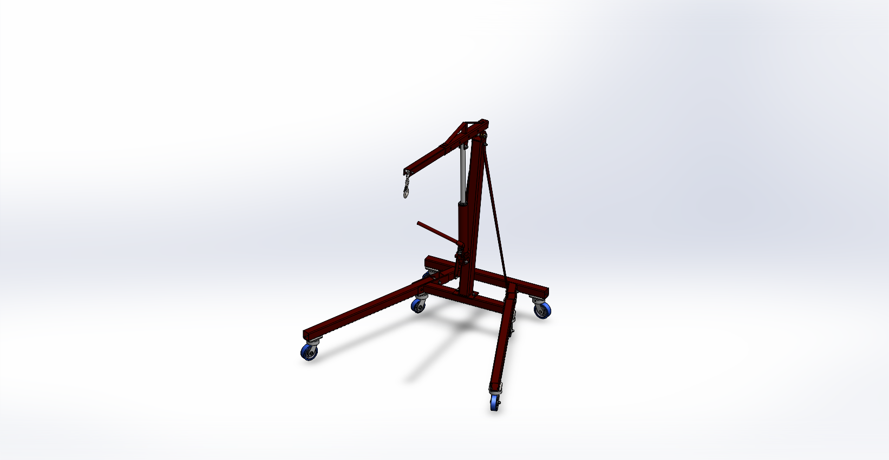
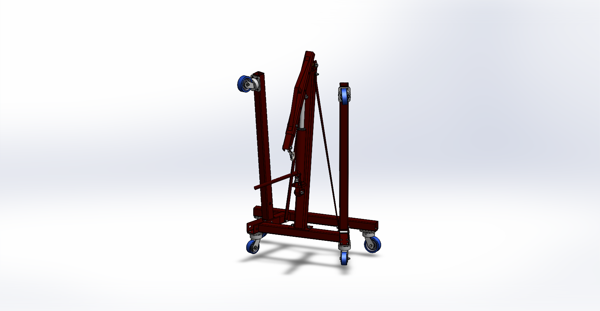
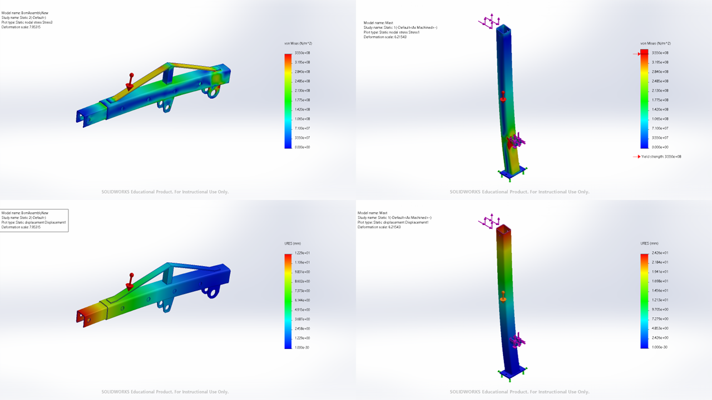

# Foldable Hydraulic Workshop Crane (2000 kg)

Design and structural analysis of a foldable hydraulic workshop crane (engine hoist) with a maximum rated lifting capacity of **2000 kg**. The project combines analytical calculations, CAD-based geometry, simplified FEA, and practical component selection, following the full load path from the hook to the caster wheels.



## Overview

| Parameter | Value |
|---|---|
| Max. rated lifting capacity | 2000 kg |
| Dynamic load factor | 1.5 |
| Main structural material | S355JR structural steel |
| Pin material | 42CrMo4 steel |
| Hydraulic cylinder | 8 ton, 505 mm stroke |
| Final CAD mass (excl. casters) | 130.2 kg |
| Hook height range | 399.9 mm – 1692.3 mm |
| Boom positions | 4 (2000 → 500 kg derated) |

## Design Highlights

- **Telescopic boom** — 75×75×5 SHS outer / 65×65×5 SHS inner, locally reinforced around the hydraulic cylinder connection after the unreinforced section failed the bending check (389 MPa vs. 177.5 MPa allowable).
- **Hydraulic cylinder near-perpendicular to boom (85°)** — minimizes required cylinder force (67.5 kN of 78.5 kN capacity) and horizontal reaction transferred to the mast.
- **Mast** — 100×100×6 SHS, checked as a conservative statically-determinate cantilever (diagonal struts neglected), bending stress 177.3 MPa vs. 177.5 MPa allowable.
- **Pin connections** — boom tip (22 mm), cylinder–boom & cylinder–mast (30 mm), mast–boom pivot (24 mm, bronze sleeve bushing for rotation) — each checked for bending, shear, and bearing.
- **Bottom frame & casters** — 4× 1000 kg-rated casters, checked against forward-tipping stability at both shortest (2000 kg) and shortest/longest boom reach configurations.
- **Kingpinless caster design** with auxiliary 125 mm storage wheels for the folded configuration.

All structural checks used a safety factor of 2 against yield. Full derivations, free-body diagrams, and catalogue component selections (hook, chain, hydraulic ram, casters) are in the design report.


## Folded Storage Configuration



## Simplified FEA — Boom & Mast

Static FEA was used as a qualitative supplement to the analytical calculations (Saint-Venant's principle applied — local stress peaks near pins/welds interpreted cautiously).



## Contents

```
report/
└── design-report-hydraulic-workshop-crane.pdf   Full calculations, FEA, references (77 pages)

drawings/
├── general-assembly-drawing.pdf                 GA drawing, open/folded/side views
└── exploded-assembly-bom.pdf                    Exploded view + 27-item BOM

images/
├── render-open-position.png
├── render-folded-position.png
├── fea-boom-assembly-displacement.png
├── fea-boom-assembly-vonmises-stress.png
├── fea-mast-displacement.png
├── fea-mast-vonmises-stress.png
└── fea-collage-summary.png
```

## Tools Used

SolidWorks (modeling, simplified FEA), analytical hand calculations (beam theory, pin/bolt design per generalized shear-bending-bearing model).
