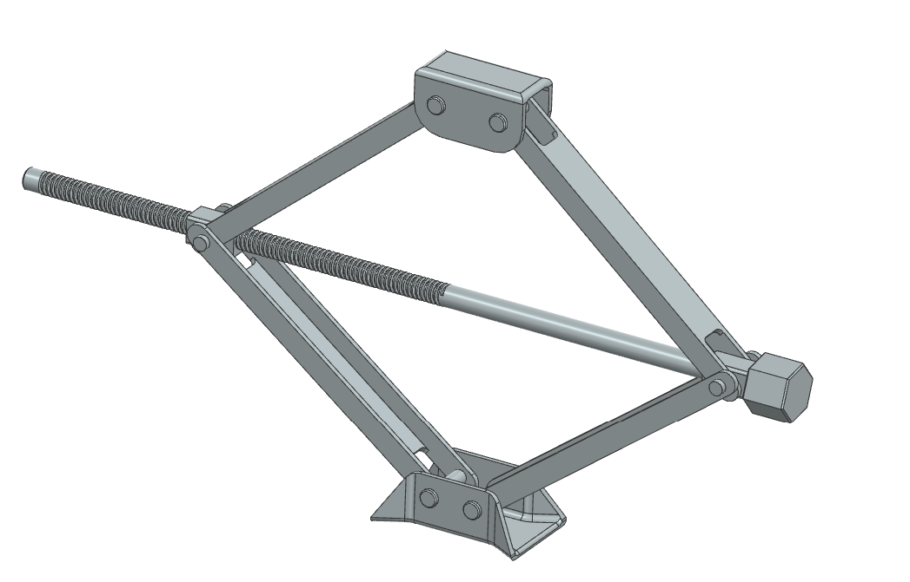
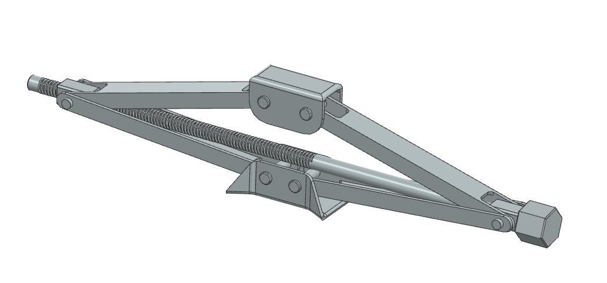

# Manual ACME Screw Scissor Jack

Mechanical design and analytical verification of a manually operated ACME screw
scissor jack rated for a 3307 lbf (1500 kg passenger vehicle) vertical load,
designed in Siemens NX.

## Overview

This is an independent machine design project covering the complete analytical
verification of a single-screw scissor jack, from linkage kinematics through
final component sizing. The mechanism uses one moving threaded trunnion nut and
one non-threaded support-side block; rotating the right-hand, single-start
3/4–6 ACME power screw changes the side-pivot distance, rotating the scissor
arms and raising or lowering the upper saddle. A design factor of 1.5 was
applied through allowable stresses throughout.

## Design Highlights

- **Kinematic layout**: Symmetric two-force-member linkage, arm length 10.4857 in,
  operating-angle range 10.5°–41.1°. The minimum angle governs, producing the
  largest arm and screw forces (≈9.07 kip arm force, ≈17.8 kip screw force).
- **Scissor arms**: HSLA Grade 80 U-channel section (1.875 × 0.800 × 0.1875 in),
  checked for compressive stress, net-section yielding, bearing, shear-out, and
  global (Johnson) buckling. The initial 0.300 in arm-end ligament was revised to
  0.400 in after a shear-out check.
- **Pivot pins**: 0.500 in AISI 4140 heat-treated clevis pins, checked for double
  shear, bracket bearing, and bending; inward-projecting support sleeves were
  added to reduce the effective unsupported pin span.
- **Power screw**: 3/4–6 ACME, RH, single-start, AISI 4140 HT. Verified for axial
  stress, lead angle, self-locking behavior (λ = 4.55° < ϕ′ = 8.8°), raising/lowering
  torque, and combined axial-torsional von Mises stress (σ_vm ≈ 91.6 ksi).
- **Threaded nut and trunnion**: C95400 aluminum bronze nut with 1.75 in thread
  engagement. The initial integral bronze trunnion failed bearing/bending checks
  and was redesigned as a separate steel sleeve (0.875 in) and AISI 4140
  through-pin (0.625 in) assembly.
- **Axial screw support**: SKF 81206 TN cylindrical roller thrust bearing,
  selected on a static-capacity basis (s₀ ≈ 1.69) for the ≈79.2 kN axial reaction.
- **Manual handle**: 24 in effective radius, 0.750 in solid AISI 1045 steel rod,
  giving a preliminary raising force of ≈58.7 lbf.
- **Base and saddle**: Bracket-root bending/bearing and base/saddle contact
  pressure checks; the lower bracket root and lower pivot bearing region were
  identified as the most critical locations and locally reinforced.

## Renders

## Drawings

- [General assembly drawing](./drawings/general-assembly-drawing.png)

## Report

- [Full design report — Mechanical Design and Analytical Verification of a Manual ACME Screw Scissor Jack](./report/design-report-scissor-jack.pdf)

## Limitations

The analysis uses classical machine-design relations (nominal stresses, average
bearing/thread pressures, idealized frictionless pins) and does not capture local
stress concentration at pivot-hole edges, sleeve ends, thread runout, or the
bracket-to-base/saddle transitions. The report recommends local finite-element
verification of these regions and a controlled physical proof-load test before
the design is considered suitable for safety-critical use.
