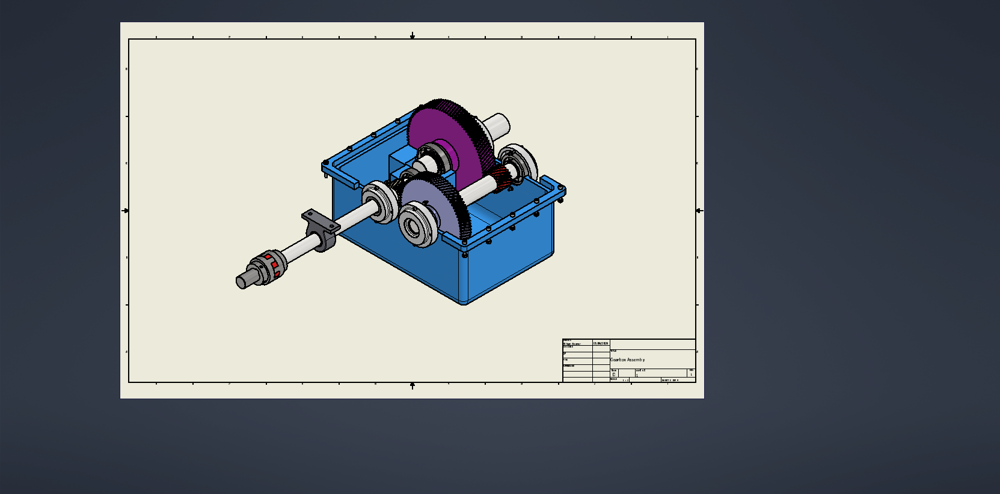
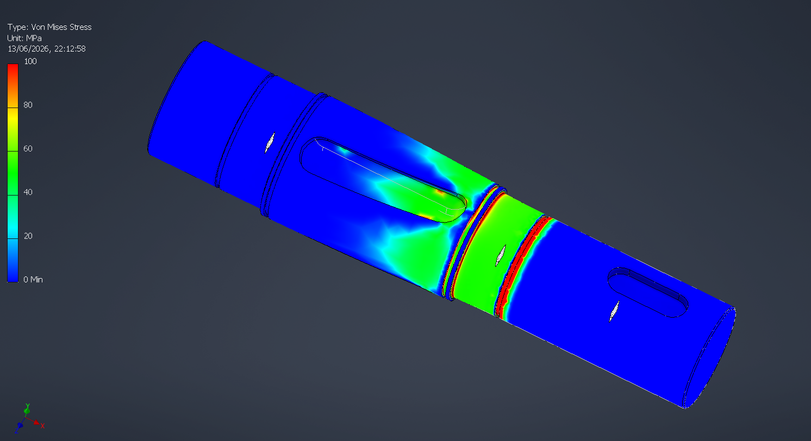
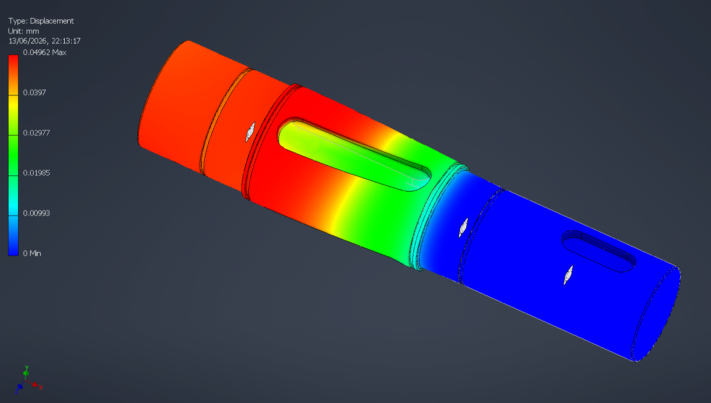

# Two-Stage Industrial Gearbox

A 15 kW two-stage helical gearbox designed for a medium-duty belt conveyor, reducing
speed from 1750 rpm to approximately 87.5 rpm, including gear, shaft, bearing,
lubrication, and housing design.

## Overview

This is an independent machine design project developed to demonstrate a complete
gearbox design workflow, from application requirements to a verified CAD assembly.
The gearbox transmits 15 kW from an electric motor at 1750 rpm down to an output
speed of 87.5 rpm through a 20:1 total reduction ratio, split across two helical
gear stages (4:1 and 5:1). The drivetrain includes a flexible jaw coupling, an
external hydrodynamic journal bearing on the input shaft extension, three internal
shafts supported on angular-contact ball bearings, and a split cast-iron housing.

## Design Highlights

- **Gear design**: Two helical gear stages (20° pressure angle, 20° helix angle,
  module 3 mm) with profile-shifted pinions (+0.3 / −0.3) to strengthen the
  smaller pinions while keeping standard center distances.
- **Gear strength verification**: Manual AGMA-style tooth-root bending and surface
  contact pressure calculations for both stages, cross-checked against Autodesk
  Inventor's ISO 6336 solver. The second-stage gear pair governs contact strength.
- **Shaft design**: Static, infinite-life fatigue (modified Goodman), deflection,
  and critical-speed analysis for all three shafts (input, intermediate, output).
  The intermediate shaft governs, with a fatigue safety factor of ~1.52.
- **Bearing selection**: Back-to-back angular-contact ball bearing pairs (SKF 7308 /
  7311 / 7213 series) sized for >12,000 h life, plus a hydrodynamic plain journal
  bearing (SAE 660 bronze bushing) on the external input shaft extension.
- **Coupling**: Torsionally flexible jaw coupling sized against working torque,
  starting torque, and speed/bore requirements.
- **Housing and sealing**: Split gray cast-iron housing with an internal bearing
  support wall, radial shaft seals on the external shafts, a non-contact seal on
  the internal intermediate shaft, and shared ISO VG 68 oil-bath lubrication.
- **Manufacturing & assembly**: Shaft turning/hobbing sequence, gear cutting and
  heat treatment, housing machining strategy, and a full assembly procedure with
  bearing adjustment and gear-mesh verification steps.
- **FEA verification**: Output shaft checked in FEA for Von Mises stress and
  displacement, confirming the DIN 471 retaining-ring grooves as the governing
  stress-concentration feature.

## Renders

## FEA / Calculations

Output shaft finite element verification, supplementing the manual fatigue and
deflection calculations:

## Drawings

- [General assembly — housing views](./drawings/general-assembly-housing-views.png)
- [General assembly — sections](./drawings/general-assembly-sections.png)
- [Intermediate shaft drawing](./drawings/intermediate-shaft-drawing.png)

## Report

- [Full design report](./report/design-report-two-stage-gearbox.pdf)
